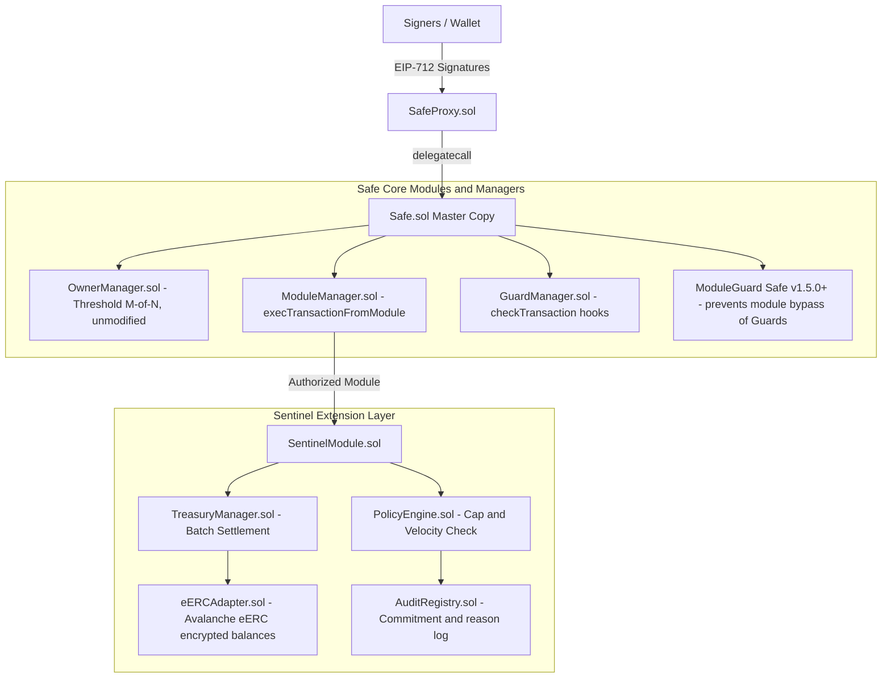
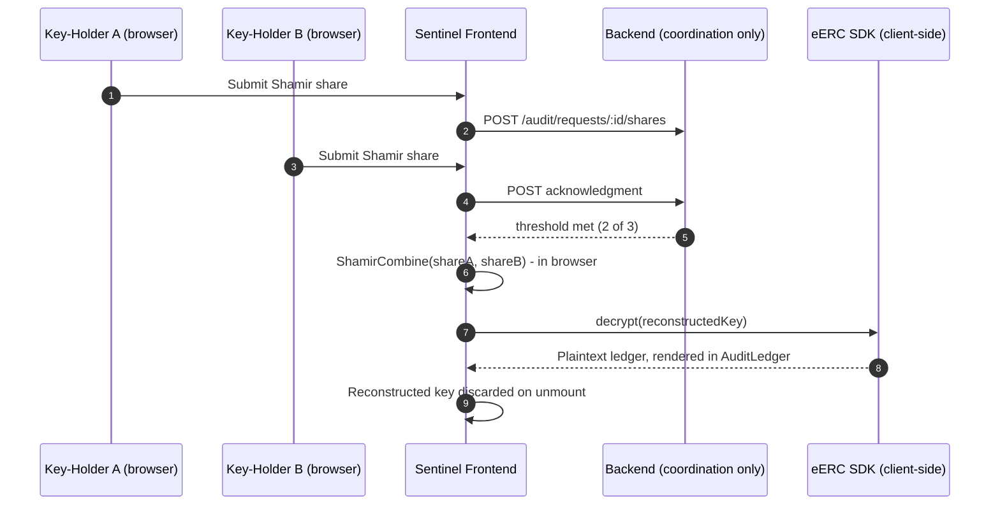
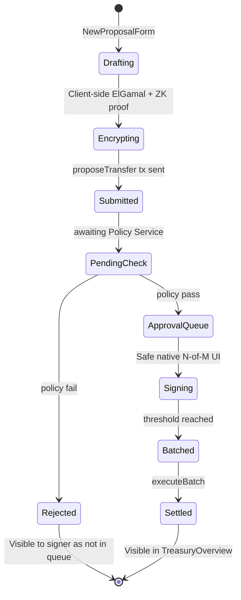

# 🛡️ Sentinel — Enterprise Privacy & Policy Engine for Safe Multi-Sig Treasuries

[](https://testnet.snowtrace.io/)
[-8B8FE8?style=flat-square&logo=next.js)](https://nextjs.org/)
[](https://hardhat.org/)
[](LICENSE)

**Sentinel** is an enterprise-grade extension module for **Safe{Wallet}** on EVM networks (Avalanche Fuji Testnet & Ethereum). It solves a critical gap in decentralized treasury management: **Safe manages multi-sig governance seamlessly, but offers zero confidentiality.**

Sentinel bridges Safe's M-of-N multisig governance with Avalanche's **eERC (Encrypted ERC)** standard and an on-chain **Zero-Knowledge Policy Engine**. Treasuries gain homomorphic payload encryption, rate-limiting policy controls, and client-side Shamir 2-of-3 auditability without forking Safe or migrating funds.

---

## 📐 System Architecture



---

## 💻 Frontend Architecture & Key Management

### 1. Application Structure (Route Groups → Components → State)

```mermaid
flowchart TD
    Root["app/layout.tsx - Root Layout"] --> Auth["auth group - Wallet-signature login"]
    Root --> Dashboard["dashboard group - Signer home"]
    Root --> Policy["policy group - Admin config"]
    Root --> Audit["audit group - Auditor viewer"]

    Auth --> ConnectWallet["ConnectWalletButton"]
    Auth --> SIWE["SIWE Signature Flow"]

    Dashboard --> Overview["TreasuryOverview - Balance, status badge"]
    Dashboard --> ProposalForm["NewProposalForm"]
    Dashboard --> ProposalQueue["ProposalQueue - Pending / Approved / Rejected"]

    Policy --> PolicyRules["PolicyRulesEditor - Cap and Velocity"]
    Policy --> AllowlistMgr["AllowlistManager"]
    Policy --> NLSetup["NL Policy Setup - prose to draft config"]

    Audit --> ShareSubmit["ShareSubmissionPanel"]
    Audit --> KeyReconstruct["ClientSideReconstruction - ShamirCombine in browser"]
    Audit --> AuditLedger["DecryptedLedgerView"]

    style Auth fill:#18181B,stroke:#8B8FE8
    style Dashboard fill:#18181B,stroke:#8B8FE8
    style Policy fill:#18181B,stroke:#8B8FE8
    style Audit fill:#18181B,stroke:#8B8FE8
```



### 2. State Management Split (TanStack Query vs. Zustand)

```mermaid
flowchart LR
    subgraph ServerState["Server and Chain-Derived State - TanStack Query"]
        Q1["Proposals list"]
        Q2["Policy rules"]
        Q3["Batch settlements"]
        Q4["Encrypted balance ciphertext"]
        Q5["Audit request status"]
    end

    subgraph LocalState["Local and Session State - Zustand"]
        Z1["Active wallet address"]
        Z2["Active organization"]
        Z3["Setup wizard step"]
        Z4["Reconstructed key - ephemeral, in-memory only"]
    end

    subgraph Components["Components"]
        C1["ProposalQueue"] --> Q1
        C2["PolicyRulesEditor"] --> Q2
        C3["TreasuryOverview"] --> Q3
        C3 --> Q4
        C4["AuditLedger"] --> Q5
        C4 --> Z4
        C5["Any component"] --> Z1
        C5 --> Z2
        C6["SetupWizard"] --> Z3
    end

    style Z4 fill:#3A1818,stroke:#E84142
```



### 3. Data Access Layer (Wagmi/Viem vs. REST)

```mermaid
flowchart TD
    UI["Frontend Components"]

    UI -->|"Wallet connect, signing, direct contract reads"| Wagmi["Wagmi Hooks"]
    Wagmi --> Viem["Viem Client"]
    Viem --> Chain["Avalanche Fuji RPC"]

    UI -->|"Policy config, proposal metadata, audit orchestration"| APIClient["REST API Client"]
    APIClient -->|"HTTPS, JWT session"| Backend["Sentinel Backend /api/v1"]

    Chain -.->|"on-chain events"| Backend

    SDK["contracts-sdk package - Typed ABIs and addresses"] --> Wagmi
    SDK --> APIClient

    style Chain fill:#18181B,stroke:#8B8FE8
    style Backend fill:#18181B,stroke:#8B8FE8
```



### 4. Key Reconstruction — Client-Side Only (Trust Boundary)



### 5. Proposal Lifecycle — Frontend View States



---

## ⚡ Key Features

1. **🔒 Homomorphic Balance Encryption (eERC)**
   - Encrypts asset quantities and transfer amounts using Avalanche's eERC standard.
   - Prevents public surveillance of treasury balances, payroll transfers, and strategic investments.

2. **🛡️ On-Chain ZK Policy Engine**
   - Enforces real-time rate limits, velocity checks, and maximum transaction caps prior to signing.
   - Automatically flags or blocks policy-violating proposals before signers execute them.

3. **👥 Dynamic Workspaces & Account Spaces**
   - **Workspace Space (`/workspace`)**: High-level organization dashboard to manage team members, address books, and multiple accounts.
   - **Account Space (`/account`)**: Granular multi-sig vault view for active asset management, transaction queues, and network activation.

4. **🕵️ Client-Side Shamir 2-of-3 Compliance Auditability**
   - Designates 3 auditor keyholders. Any 2-of-3 auditors can reconstruct transaction histories client-side for regulatory compliance without leaking private keys to backends.

5. **🎨 Sentinel Motion Design System**
   - Sleek cyberpunk privacy aesthetic using periwinkle (`#8B8FE8`) accents, near-black dark mode (`#0A0A0B`), scramble text decryptions, and subtle glow backdrops.

---

## ⛓️ Deployed Smart Contracts (Avalanche Fuji Testnet)

All core smart contracts are compiled and deployed on-chain to Avalanche Fuji Testnet:

| Contract Name | Address (Fuji Testnet C-Chain) | Explorer Link |
| :--- | :--- | :--- |
| **`SentinelModule`** | `0xfdEd4eC3942315F1648CCD66F96Ca7bd7CaD8365` | [View on SnowTrace ↗](https://testnet.snowtrace.io/address/0xfdEd4eC3942315F1648CCD66F96Ca7bd7CaD8365) |
| **`TreasuryManager`** | `0x3baAE85a11BB633c6587eCFe1E2b2F7Aa0c80095` | [View on SnowTrace ↗](https://testnet.snowtrace.io/address/0x3baAE85a11BB633c6587eCFe1E2b2F7Aa0c80095) |
| **`eERCAdapter`** | `0x62B9aF3851E8FF3DCab454F299681195011e6888` | [View on SnowTrace ↗](https://testnet.snowtrace.io/address/0x62B9aF3851E8FF3DCab454F299681195011e6888) |
| **`PolicyEngine`** | `0x0157461654bB9A1025ba7bE5af46bB909A41Bd1f` | [View on SnowTrace ↗](https://testnet.snowtrace.io/address/0x0157461654bB9A1025ba7bE5af46bB909A41Bd1f) |
| **`AuditRegistry`** | `0xfA705DFDae21a7e21CBc7e61aa3323dFa3D7bDB6` | [View on SnowTrace ↗](https://testnet.snowtrace.io/address/0xfA705DFDae21a7e21CBc7e61aa3323dFa3D7bDB6) |

---

## 📂 Repository Structure

```
Sentinel/
├── frontend/                   # Next.js 14 Web Application
│   ├── src/
│   │   ├── app/                # App Router Routes (/workspace, /account, /accounts, /onboarding)
│   │   ├── components/         # Reusable UI & Motion Components
│   │   └── lib/                # Storage helpers (safe-storage.ts) & EIP-712 utilities
├── contracts/                  # Solidity Smart Contracts & Hardhat Environment
│   ├── src/                    # SentinelModule, PolicyEngine, eERCAdapter, TreasuryManager
│   ├── scripts/                # Hardhat Deployment & Interaction Scripts
│   └── hardhat.config.js       # Hardhat Compiler & Network Configs
├── policy-service/             # Off-Chain Policy Verification Service
├── Sentinel_plan.md            # Comprehensive Technical Positioning & Plan
└── design.md                   # Sentinel Design System Specifications
```

---

## 🛠️ Getting Started & Local Setup

### Prerequisites
- **Node.js**: `v18.x` or higher
- **npm**: `v9.x` or higher

### 1. Installation

Clone the repository and install dependencies for both root and frontend:

```bash
# Clone the repository
git clone https://github.com/Soujanya-Mctrl/Sentinel.git
cd Sentinel

# Install contracts & frontend dependencies
cd contracts && npm install
cd ../frontend && npm install
```

### 2. Run the Development Server

```bash
cd frontend
npm run dev
```

Open [http://localhost:3000](http://localhost:3000) in your browser.

### 3. Compile & Deploy Smart Contracts

```bash
cd contracts

# Compile Solidity contracts
npx hardhat compile

# Deploy contracts to local Hardhat network
npx hardhat run scripts/deploy.js

# Deploy contracts to Avalanche Fuji Testnet
npx hardhat run scripts/deploy.js --network fuji
```

---

## 🚀 Application Navigation Flow

1. **Onboarding (`/onboarding`)**: Authenticate via EVM Wallet (MetaMask, Core, WalletConnect), Google, or Email.
2. **Workspaces Directory (`/accounts?tab=workspaces`)**: View existing workspaces or launch the 4-step Workspace Creation Wizard.
3. **Workspace Home (`/workspace`)**: Overview of workspace assets, accounts list, pending transactions queue, and workspace setup guide.
4. **Account Dashboard (`/account`)**: Detailed vault view with network switchers, QR code deposit options, address book, transaction history, and contract version settings (`1.4.1`).

---

## 📄 License

Distributed under the MIT License. See `LICENSE` for more information.
